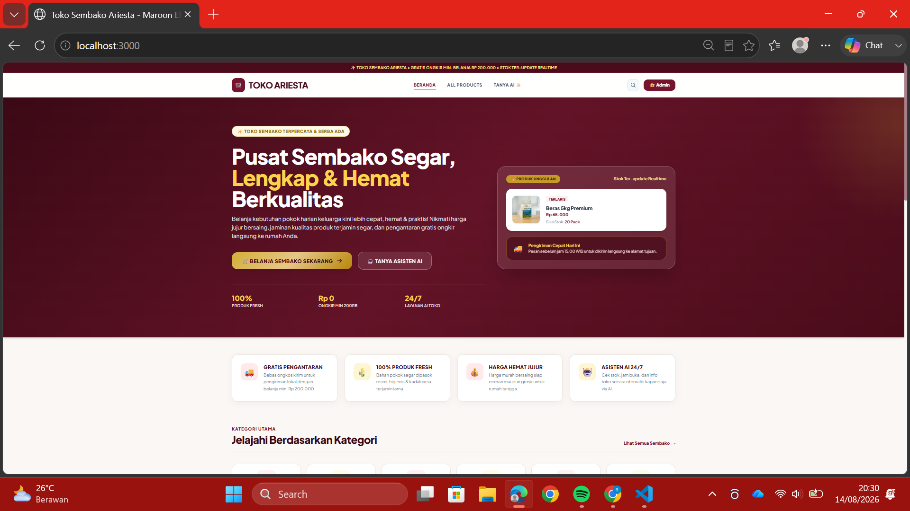
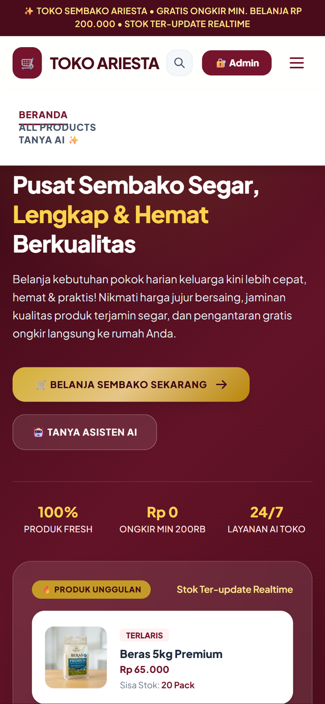
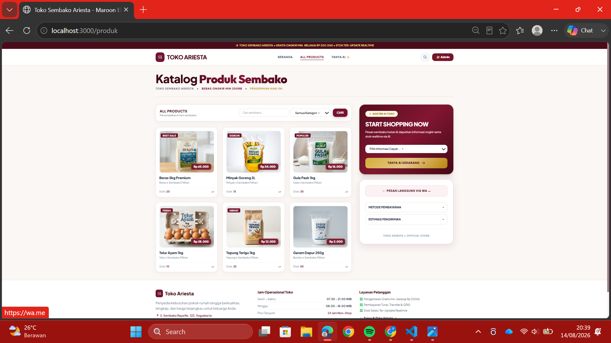
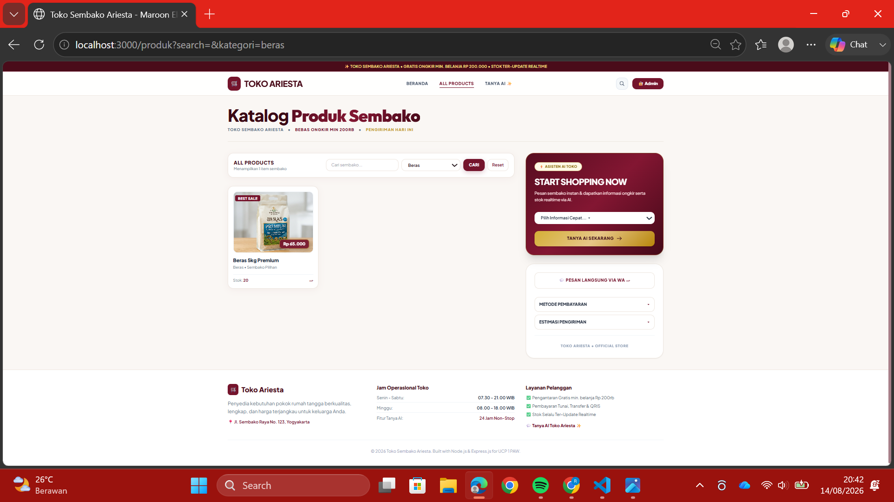
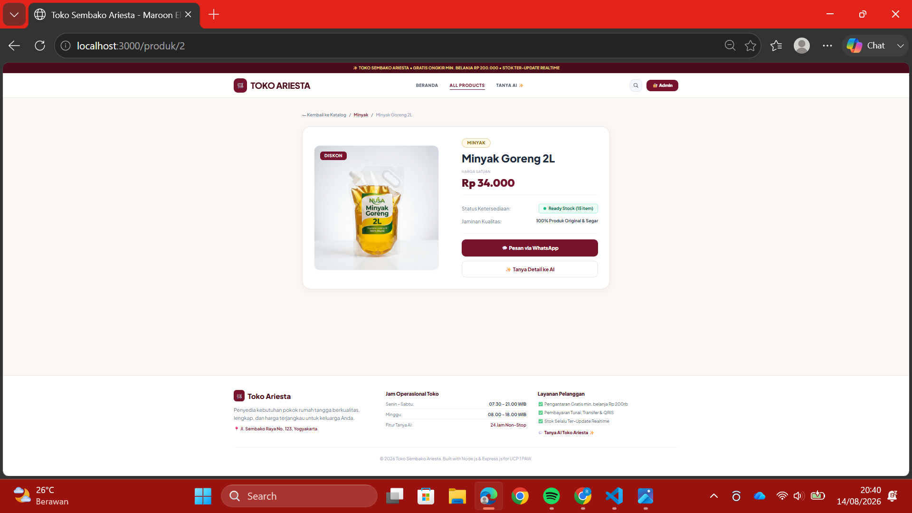
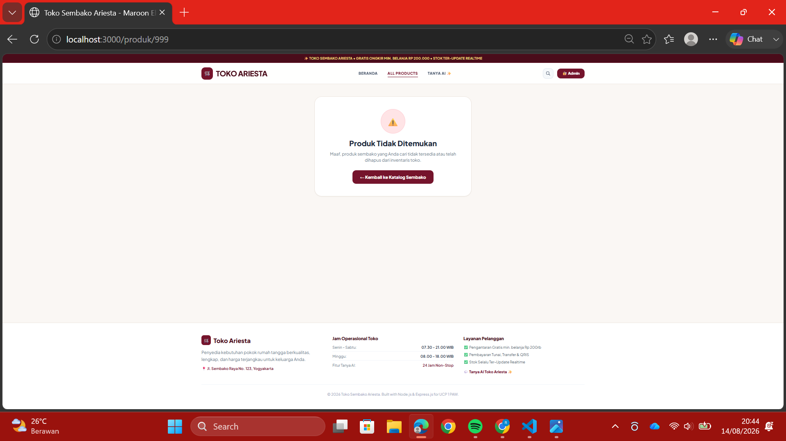
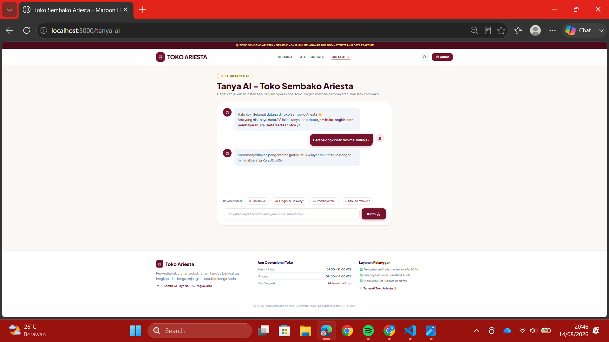
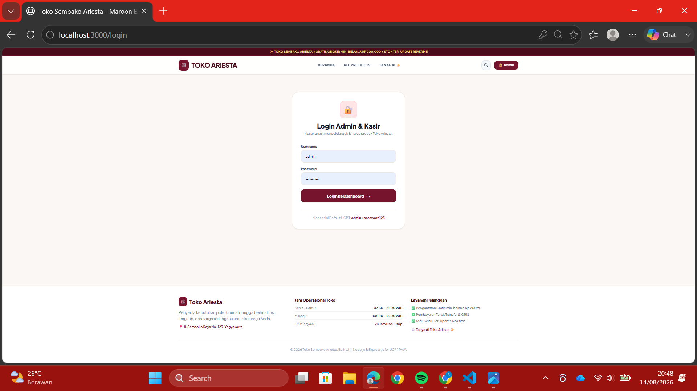
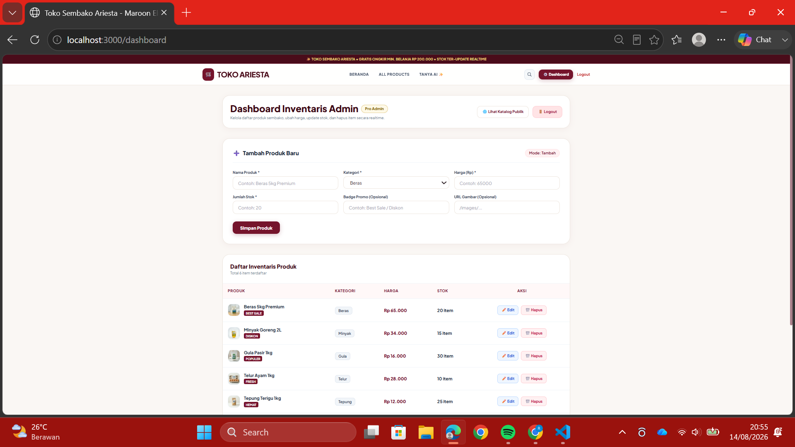

# 🛒 Website & REST API "Toko Sembako Ariesta" dengan Fitur Tanya AI

Proyek UCP 1 Pemrograman Aplikasi Web (PAW) — Full Stack Node.js & Express.js.

## 👤 Informasi Mahasiswa
- **Nama**: Rachel Nova
- **NIM**: 20240140241
- **Kelas**: Pemrograman Aplikasi Web (PAW) - B
- **Dosen Pengampu**: Ir. Asroni, S.T., M.Eng.
- **Asisten Dosen**: Rizki Ramadan, Reza Azhari

---

## 📝 Deskripsi Proyek
**Toko Sembako Ariesta** adalah aplikasi web full stack yang dirancang untuk membantu Ibu Aries mengelola inventaris sembako (beras, minyak goreng, gula, telur, tepung, bumbu) secara efisien dan mandiri.

Aplikasi ini dilengkapi dengan:
- **Katalog Publik & Detail Produk**: Memungkinkan pelanggan melihat daftar produk sembako, harga, dan sisa stok secara realtime tanpa reload halaman.
- **Fitur "Tanya AI"**: Asisten otomatis berbasis logika backend Express (dummy rule-based) yang menjawab pertanyaan umum pelanggan seputar jam operasional, pengantaran/ongkir, cara pembayaran, dan ketersediaan stok sembako.
- **Dashboard Admin & Autentikasi Login**: Dilindungi dengan sistem login berbasis session dan enkripsi password `bcrypt` agar mutasi data produk (tambah, edit harga/stok, hapus) hanya dapat dilakukan oleh pemilik toko/kasir.
- **REST API Full CRUD**: Endpoint JSON standar yang melayani operasi `GET`, `POST`, `PUT`, dan `DELETE` secara konsisten.

---

## 🚀 Cara Menjalankan Proyek Secara Lokal

### Prerequisites
- Node.js (versi 16 atau lebih baru)
- npm (Node Package Manager)

### Langkah Pengerjaan
1. Buka folder repositori proyek ini di terminal:
   ```bash
   cd pawantara-a-ucp1-nim
   ```

2. Install seluruh dependensi proyek:
   ```bash
   npm install
   ```

3. Jalankan server pengembang menggunakan Nodemon (Auto-restart):
   ```bash
   npm run dev
   ```
   *Atau jalankan server secara langsung dengan Node.js:*
   ```bash
   npm start
   ```

4. Akses aplikasi melalui peramban web (browser):
   ```
   http://localhost:3000
   ```

---

## 🔐 Kredensial Akun Admin & Kasir
Untuk mengakses halaman dashboard inventaris dan menguji endpoint mutasi REST API:
- **Username**: `admin`
- **Password**: `password123` *(Password disimpan dan diverifikasi menggunakan hashing Bcrypt)*

---

## 📡 Kontrak REST API

Seluruh response API dikembalikan secara konsisten dalam format JSON `{ status, message/total, data }`.

| Method | Endpoint | Akses | Deskripsi | Contoh Response JSON |
| :--- | :--- | :--- | :--- | :--- |
| **POST** | `/api/login` | Publik | Login admin/kasir dengan username & password | `{ "status": "success", "message": "Login berhasil" }` |
| **POST** | `/api/logout` | Login | Logout admin dan menghentikan sesi login | `{ "status": "success", "message": "Logout berhasil" }` |
| **GET** | `/api/products` | Publik | Mengambil seluruh data produk (dukung filter `?kategori=` & `?search=`) | `{ "status": "success", "total": 6, "data": [ ... ] }` |
| **GET** | `/api/products/:id` | Publik | Mengambil detail 1 produk berdasarkan ID | `{ "status": "success", "data": { "id": 1, "name": "Beras 5kg Premium", "price": 65000, "stock": 20 } }` |
| **POST** | `/api/products` | Login | Menambahkan produk sembako baru ke inventaris | `{ "status": "success", "message": "Produk ditambahkan", "data": { ... } }` |
| **PUT** | `/api/products/:id` | Login | Mengubah nama, harga, stok, atau gambar produk | `{ "status": "success", "message": "Produk diperbarui", "data": { ... } }` |
| **DELETE** | `/api/products/:id` | Login | Menghapus produk dari inventaris berdasarkan ID | `{ "status": "success", "message": "Produk dihapus", "data": { ... } }` |
| **POST** | `/api/chat` | Publik | Mengirim pertanyaan dan menerima balasan AI dummy dari backend | `{ "status": "success", "data": { "reply": "Toko Sembako Ariesta buka setiap hari..." } }` |

*Catatan: Endpoint yang membutuhkan akses **Login** akan mengembalikan HTTP Status Code `401 Unauthorized` dengan pesan `{ "status": "error", "message": "Unauthorized, silakan login terlebih dahulu" }` jika diakses tanpa login.*

---

## 🎨 Penjelasan Tampilan Antarmuka (UI)

Seluruh antarmuka aplikasi dirancang menggunakan **Tailwind CSS CDN** dengan tema warna utama **Tazaj Mart Green (`#115c38`)** dan tata letak responsif (mobile & desktop).

### 1. Halaman Beranda (`/`)
- **Hero Banner**: Menyampaikan promo gratis ongkir dan tombol ajakan melihat produk / Tanya AI.
- **Feature Cards**: Menjelaskan keunggulan pengantaran gratis, stok realtime, dan asisten AI.
- **Preview Produk**: Menampilkan kartu produk pilihan yang selaras dengan katalog utama.



### 2. Navbar Mobile (Hamburger Menu)
Menu hamburger yang bisa dibuka/tutup dengan JavaScript di tampilan mobile.



### 3. Halaman All Products (`/produk`)
- **Search & Filter Bar**: Form pencarian produk berdasarkan nama dan dropdown filter kategori (`beras`, `minyak`, `gula`, `telur`, `tepung`, `bumbu`).
- **Product Grid**: Grid responsif (2 kolom di mobile, 4 kolom di desktop) berisi gambar sembako presisi, badge promo (`Best Sale`, `Diskon`, `Fresh`), harga `Rp XX.XXX`, stok, dan tombol cepat `+`.



### 4. Hasil Filter / Pencarian Produk
Contoh: `/produk?kategori=minyak` atau `/produk?search=beras`.



### 5. Halaman Detail Produk (`/produk/:id`)
- **Dynamic Route**: Tampilan 2 kolom memuat foto produk beresolusi tinggi, tag kategori, harga, status ketersediaan stok realtime, dan tombol order via WhatsApp.



### 6. Halaman Detail Produk — Not Found (`/produk/999`)
Penanganan ID tidak ditemukan dengan pesan 404 yang wajar (bukan crash server).



### 7. Halaman Tanya AI (`/tanya-ai`)
- **Interactive Chatbox**: Tampilan percakapan modern dengan bubble chat hijau untuk pelanggan dan abu-abu untuk AI.
- **Quick Prompt Chips**: Tombol pintas pertanyaan umum (Jam Buka, Ongkir, Pembayaran, Stok Sembako).
- **Fetch API Integration**: Mengonsumsi `POST /api/chat` secara asynchronous tanpa reload halaman.



### 8. Halaman Login Admin (`/login`)
- **Form Aksesibel**: Kartu login ringkas dengan validasi input dasar dan pesan alert interaktif jika kredensial salah.



<!-- TODO: tambahkan screenshot percobaan login dengan password salah, lalu ganti baris di bawah ini -->


### 9. Halaman Dashboard Admin (`/dashboard`)
- **Protected View**: Hanya bisa dibuka setelah login.
- **Form CRUD**: Form serbaguna untuk Tambah dan Edit produk sembako (nama, kategori, harga, stok, badge, URL gambar).
- **Tabel Inventaris**: Tabel inventaris rapi dengan tombol aksi `✏️ Edit` dan `🗑️ Hapus` yang langsung memperbarui DOM dan server state via Fetch API (`POST`, `PUT`, `DELETE`).



### 10. Pengujian Tambah / Edit / Hapus Produk
<!-- TODO: file belum ada — screenshot dashboard setelah menambah produk baru -->


<!-- TODO: file belum ada — screenshot proses edit harga/stok produk -->


<!-- TODO: file belum ada — screenshot setelah hapus produk -->


### 11. Log Terminal Server (Custom Logger Middleware)
<!-- TODO: file belum ada — screenshot terminal yang memperlihatkan log request HTTP -->


---

## 📮 Pengujian REST API via Postman

<!-- TODO: folder postman/ belum ada di screenshots — buat screenshot berikut lalu simpan di pawantara-a-ucp1-nim/screenshots/postman/ -->

### GET /api/products


### GET /api/products/:id


### POST /api/login (berhasil)


### POST /api/login (gagal)


### POST /api/products — tanpa login (401 Unauthorized)


### POST /api/products — sudah login


### PUT /api/products/:id


### DELETE /api/products/:id


### POST /api/chat


### POST /api/logout


---
